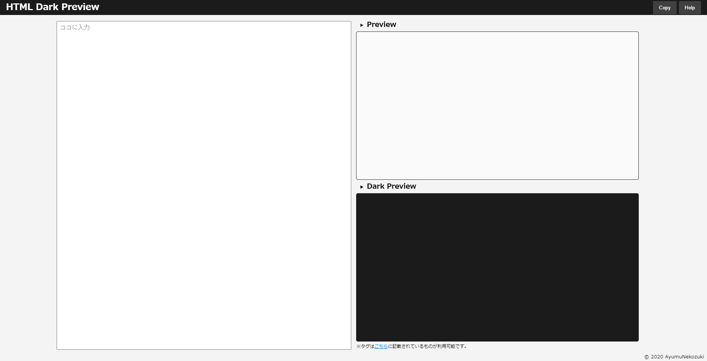

# HTML Dark Preview

niconico概要欄のhtmlをすぐにプレビューできるサイトです。

## このツールについて
ニコニコ生放送で枠取りをする際に、「概要欄」のプレビューがなくて面倒だなと思ったことはありませんか？
このツールを使うことで簡単に概要欄が書けちゃいます！

## 使い方
画面左側のテキスト入力欄に文章を入力すると、右側にプレビューが表示されます！
ダークモードのプレビューもあるので、スマホ上で文字と同化して読めない…といったことも防げます！

## 仕様
サイト右上 Help をご確認ください。

## Auther
猫月遥歩（ねこづきあゆむ） / AyumuNekouzki

[Twitter](https://twitter.com/nekozuki_dev)

## Lisence
MIT